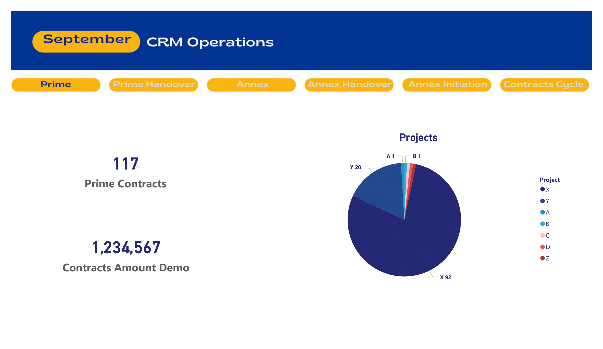
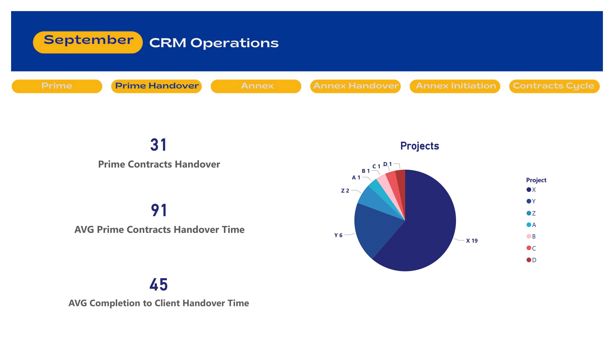
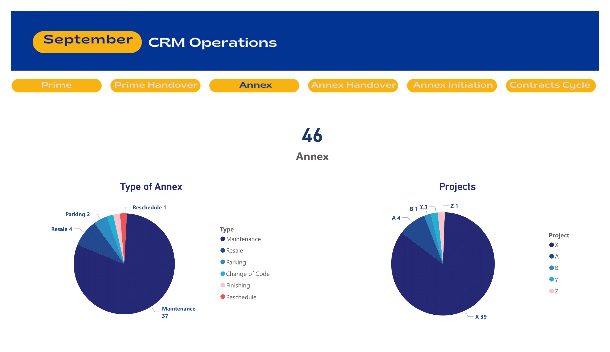
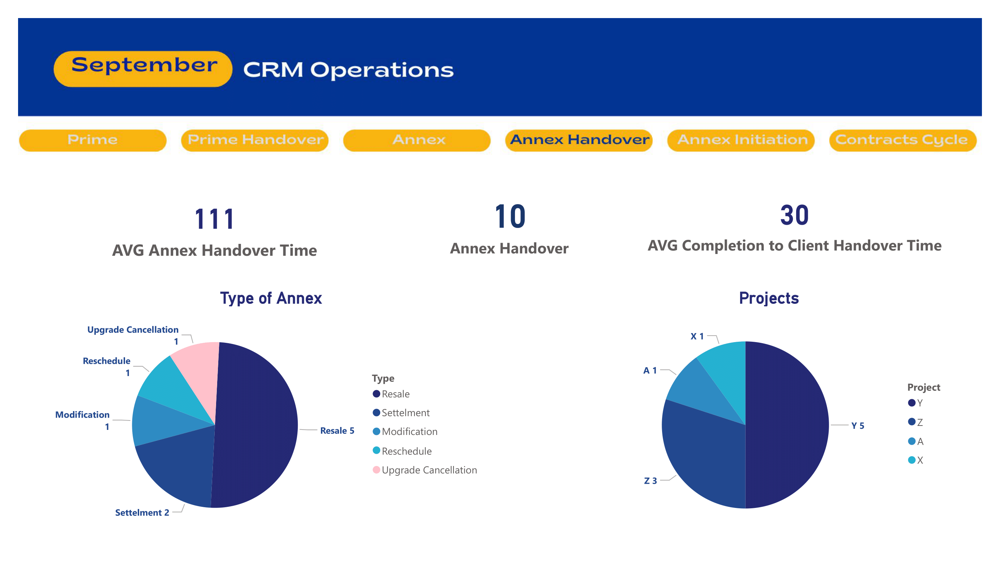
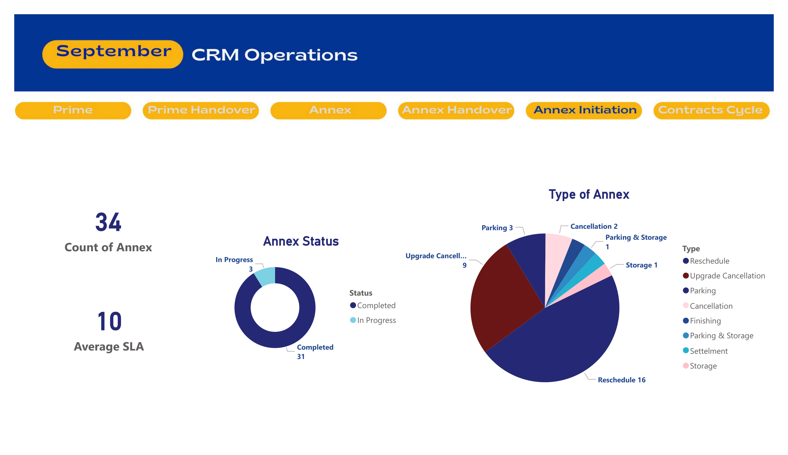
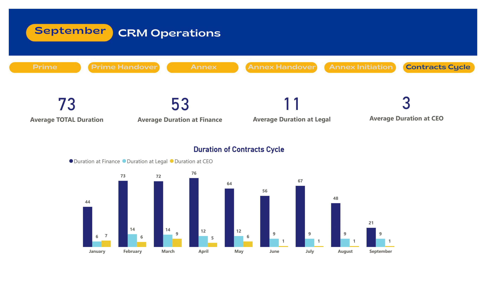

# **Contracts Team Dashboard**  

## **Project Overview**  
This dashboard was developed for the Contracts Team to **analyze and track contracts progress** across different stages. It provides visibility into Prime contracts, Annex contracts, handovers, and the overall contracts cycle. The tool was designed in Power BI with **interactive buttons** for smooth navigation across six main views.  

> All sensitive project data (such as project names) has been anonymized for portfolio purposes.  

## **Dashboard Features**  
- **Interactive Navigation** – Users can switch between six views with a single click.  
- **Contracts Tracking** – Covers Prime and Annex contracts from initiation to handover.  
- **Time Analysis** – Average durations for handover, approval, and completion.  
- **Annex Insights** – Breakdowns by type (maintenance, resale, reschedule, parking, etc.).  
- **Cycle Monitoring** – Full visibility into the contracts lifecycle, from initiation to client delivery.  

## Dashboard Preview  
### Prime Contracts  

### Prime Contracts Handover  

### Annex Contracts  

### Annex Contracts Handover  

### Annex Initiation  

### Contracts Cycle  

## **Slide Titles & Descriptions**  

1. **Prime Contracts**  
   - Displays count and value of Prime contracts by project.  
   - Highlights total contracts and financial amounts.  

2. **Prime Contracts Handover**  
   - Tracks number of Prime contracts handed over.  
   - Includes **average handover time** and **completion-to-client handover duration**.  

3. **Annex Contracts**  
   - Shows count of Annex contracts across projects.  
   - Breaks down by type (e.g., maintenance, resale, parking, finishing, reschedule).  

4. **Annex Contracts Handover**  
   - Monitors Annex contract handovers by type and project.  
   - Provides **average annex handover time** and **completion-to-client handover duration**.  

5. **Annex Initiation**  
   - Tracks newly initiated Annex contracts per type.  
   - Includes SLA insights and Annex status (completed vs in progress).  

6. **Contracts Cycle**  
   - End-to-end view of the **full contracts lifecycle**.  
   - Measures durations at CEO, Legal, Finance, and overall approval stages.  
   - Monthly breakdown of average cycle time.  

## **Business Impact**  
- **Efficiency Gains** – Automated tracking reduced manual follow-ups on contract progress.  
- **Bottleneck Identification** – Clear visibility into cycle durations helped pinpoint delays at legal, finance, or CEO approval stages.  
- **Faster Decision-Making** – Managers could instantly see which contracts were pending, completed, or delayed.  
